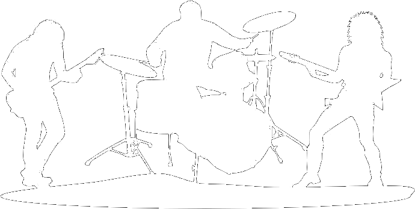

<!--

WARNING!! DON'T EDIT THE FILE README.md on the root of the project, that one is a GENERATED FILE!

You should just edit the source file at src/README.md - the one which stars with ## Unit Test Rock Band

-->

## Unit Test Rock Band



Rafael Paiva @ [Avenue Code](http://www.avenuecode.com)

*rafaelpaivabh@gmail.com*

Oct 16th, 2014

---

## Agenda

- Unit Test
  - What is it?
  - Is it worth it?
  - Benefits
- My Rock Band
  - Karma
  - Mocha
  - Chai
  - Chai jQuery
  - Istanbul


----

## Agenda

- Learn more
- Conclusion
- Assignment

---

## Prerequisites

- Javascript
- jQuery
- Grunt?

---

## Unit Test

- What is it?
  - At a high-level, unit testing refers to the practice of testing certain functions and areas (or units) of our code. This gives us the ability to verify that our functions work as expected.
- Is it worth it?
  - Unit testing is a lot like going to the gym:
    - You know it's good for you.
    - All the arguments make sense.
    - It takes time and effort.
    - You may not see the results immediately.
    - But it can definitely save lives!

----

## Unit Test

- Benefits
  1. Finds problems early
  1. Facilitates change
  1. Simplifies integration
  1. Saves development time
  1. Documentation
  1. ...


---

## My Rock Band

----

## Why a Rock Band?

- Like a Rock Band each part has its own responsibilities.
- The Unit Test Rock Band is composed by the right tool for each need to make the unit testing world perfect and easy :)

----

## Karma

- A simple tool that allows you to execute JavaScript code in multiple real browsers.
- It launches one (or more) web browser in order to run tests and evaluate its results via command line or another specified output. It also watches for file-changes in order to re-trigger tests when any change is caught. It can also be set to generate coverage reports using proper tools.
- Karma is not a testing framework, nor an assertion library. Karma just launches a HTTP server, and generates the test runner HTML file from your testing framework.


----

## Working

1. Open up *config.json* and fill your talk data such as title, author, email, date and description.
  - That is the *ONLY FILE* you should edit on the project root!
1. Any further change you will do is inside the *src* folder, such as:
  - *src/README.md* to write your talk content in *Markdown*
  - *src/index.html* to modify the HTML
1. Grunt will generate files on the project root as you change *src*.
1. In order to separate slides horizontally, use 3 dashes (---).
1. In order to separate slides vertically, use 4 dashes (----).
1. In order to *call out attention*, put an asterisk around your text:
```
In order to *call out attention*, ...
```

----

## Deploying

1. Make sure your build is not breaking.
  - You should see *Done, without errors.* in the terminal.
1. *git add*, *git commit* and *git push* to *gh-pages* branch.
1. You should see your talk in an address like:
  - http://*your-github-username*.github.io/*your-repo-name*
  - Ex: <http://acbr.github.io/talk-template>

---

## Your talk

 - Should last no more than 50 minutes, leave up to 10 minutes for questions.
 - Should not be too deep neither too superficial.
 - Give at least 3 reference links to be followed for further studies.
 - Give a challenge that would be solved using ideas that were covered on the talk.
 - It is ok to go a little bit far (forcing the attendee to do some research), but that should be optional.

----

## Organization

 - 1st slide: the cover, featuring your talk name, your name, the lecture date and AC logo.
 - 2nd slide: the agenda, in topics.
 - 3nd slide: the prerequisites of your talk.
 - From 4th slide on: your content
  - When content from the same topic doesn't fit on a slide -> grow it *VERTICALLY* by adding a slide below (----).
  - When you finish a topic and will start a different one -> grow it *HORIZONTALLY* by adding a slide to the right (---).
 - The 3 last slides: Conclusion, Learn more (with the reference links) and Challenge.

----

## Content requirements

1. *BE CONSISTENT*. Master the subject and do not contradict yourself.
1. *CATCH THE ATTENTION*. Let the audience know WHY they cannot live one more day without this technology.
1. *BALANCE THEORY AND PRACTICE*. Your target is keeping the subject interesting for everybody.
1. *BE CONCISE*. Don't overexplain in such way you could cause confusion to your attendees.
1. *KEEP THE FOCUS*. Off-topic discussions are ok, but only if it doesn't disturb the natural flow of your content.
1. *BE PREPARED*. If you are going to use examples or live coding, make sure you have them all prepared beforehand.

----

## Communication requirements

1. *COMMUNICATE WELL*. Be sharp on English, no bad words or slangs and use the best words for the audience.
1. *BE A PRO*. Please watch some good screencasts in order to learn how to use your voice and conduct the talk.
1. *BE POLITE*. Be respectful and avoid heavy criticism.
1. *BE PROFESSIONAL*. Use jokes and humor with parsimony.
1. *TRAIN* your full talk at least once before your talk.

----

## The DONT's

1. *DO NEVER SHOW PRIVATE CODE FROM THE CLIENT*. This is CRITICAL and can cause serious problems.
1. *DON'T BE ARROGANT*. Be humble and don't focus the talk on yourself.
1. *DON'T GENERALIZE*, specially stuff that you are not sure about.
1. *DON'T MAKE UP DATA*. Base yourself on trustable references.
1. *DON'T TALK LIKE A ROBOT*. Just be yourself, natural. Relax :)

----

## Tips

 - *ENJOY* your experience by creating the talk, because you will surely learn MUCH MORE than your attendees.
 - *BRING WATER* to drink while you present. You will certainly need it!
 - *BE OPEN* to receive questions and even criticism. You will learn a lot from them.
 - *ALWAYS* be polite when talking to your audience. This will always open doors for you.
 - People might come to you with questions and more complex cases after your talk. Consider it as a gift, it means you represent something good for them!

----

## If you are recording

- Make sure you use a professional microphone when available.
- Don't do *drastic transitions* on your screen, as the recorded amount of frames per second is low.
- Ask atendees to only make questions on the end - so future watchers will just get the real content without interruption.
- Introduce yourself: "Hello everybody, my name is xxxx, I work for Avenue Code and today's talk will be about yyyyy". Finish it like: "That's it, thanks for watching.".
- Problems with recording/connection? Always restart from the beginning of the slide. Don't try to restart from where it fails, its impossible to do a clean cut on the video after that.

---

## Contributing

Should you wish to contribute, please be welcome to!

1. Fork the repository <https://github.com/acbr/talk-template>
1. Create a feature branch for your contribution
```sh
git checkout -b my-new-feature
```
1. Commit your changes
```sh
git commit -am 'Add some feature'
```
1. Push to the branch
```sh
git push origin my-new-feature
```
1. Create a Pull Request

---

## Conclusion

- This talk template rocks!
- Your life should be easier now.

---

## Learn more

1. [Markdown Cheatsheet](https://github.com/adam-p/markdown-here/wiki/Markdown-Cheatsheet)
1. [Reveal.JS](https://github.com/hakimel/reveal.js)
1. [Grunt](http://gruntjs.com)

---

## Challenge

1. Make your awesome talk based on this template.
1. Push it to a gh-pages branch on your GitHub account.
1. Share the URL with the world!
